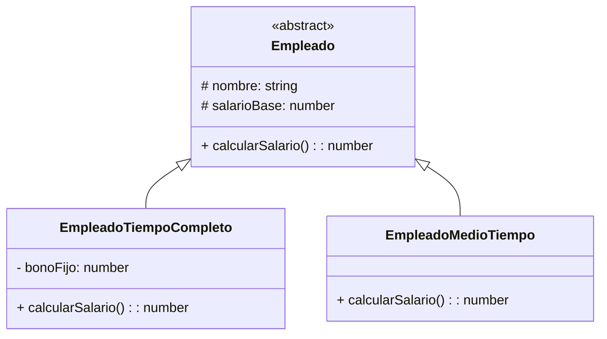
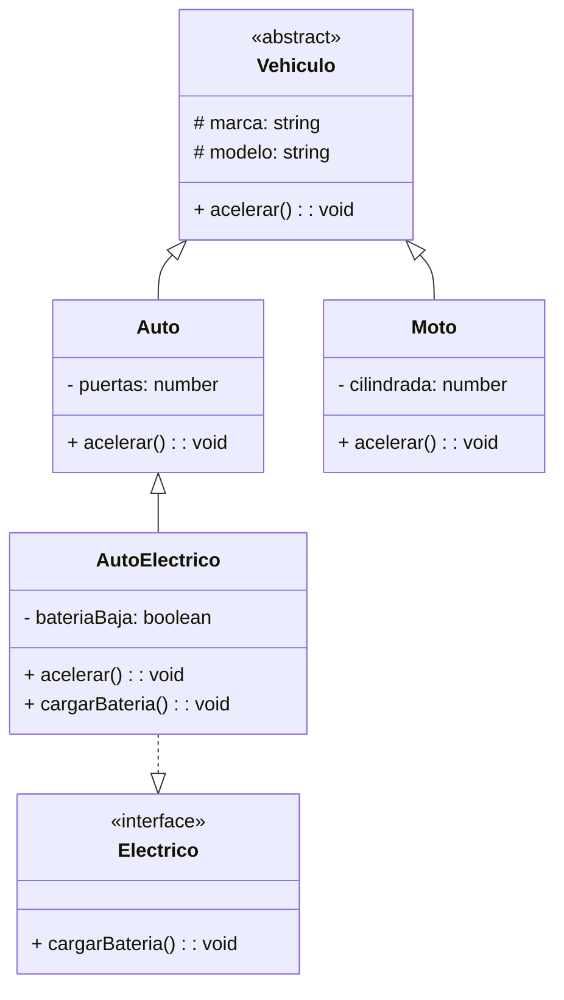

##  Integrantes
- Angelina Rossi
- Lisandro Alvarez
- Ana Paula Schechtel
- Mateo Belatti

##  Estructura
src/
── ejercicio1/ # Interfaces (Animal, Perro)
── ejercicio2/ # Clases abstractas (FiguraGeometrica, Cuadrado, Círculo, Triángulo)
── ejercicio3/ # Herencia y Polimorfismo (Empleado, EmpleadoTiempoCompleto, EmpleadoMedioTiempo)
── ejercicio4/ # UML Animal, Pájaro, Zorro, Volador
── ejercicio5/ # UML Vehículos, Auto, Moto, AutoElectrico, Electrico

## Diagramas UML

## Ejercicio 3 - Empleado

##  Ejercicio 5 - Vehículos

